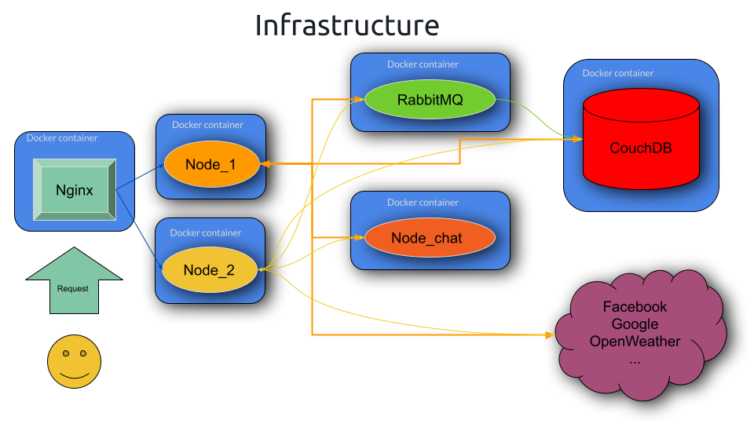

# Sunday Holiday
Computer Networks Project AA 2018/19 of Sapienza, University of Rome, course held by prof. [Andrea Vitaletti](https://github.com/andreavitaletti/RC)


## Abstract
This project consists of a web application to organize trips and events with other people, collecting information about places such as weather, date, user rating, useful links, etc.


## External services
The external services used in this project are:

- **Google Places**: from which we take information aboutn places and users'evaluations about them.
- **Facebook Graph**: from which we take photos and Facebook links about places. 
- **OpenWeather**: from which we take weather information about places.
- **Google Calendar**: where we store the events, using OAuth2 authentication.

## Services
The services used in this project are:
- `docker`: containerization, image building and orchestration
- `nginx`: static resources and load balancer functionalities 
- `node`: backend with dynamic resources
	- 2 load balanced instances are used to application logic.
	- 1 instance handles chat functionalities and WebSocket connections.
- `express`: backend that build dynamic pages
- `passport`: automate authentication procedure using `OAuth`, with both `Google` and `CouchDB`.
- `couchDB`: user and event NoSQL database.
- `amqp`: events' comments.
- `WebSocket`: global Chat.


## API
It is offered this set of APIs:
- Create an event
- Get an event
- Delete an event

API documentation is available at: [SundayHode v1.0.0 API](https://app.swaggerhub.com/apis/fcolasante/sundayHoliday/1.0.0)

# Usage
To start the application, run the following command:


0. Clone the repository:
 ```s
	git clone https://github.com/fcolasante/sundayholiday.git
	cd sundayholiday
```	
  1. Register to external services and generate tokens (*Facebook*, *OpenWeather*, *Google Calendar*) 
  2. Modify the file `secret.example.js` in `secret.js`, updating the values of the tokens.
  3. Install `docker` and `docker-compose`

1. Start the containers:
```s
	docker-compose up
```	